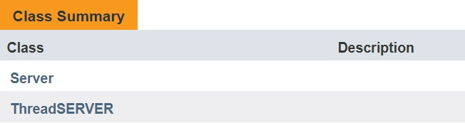

<h1>Chat Project</h1>  
Created during an Communications and computerization course at Ariel University 2018.
<h3>Project site: <a>https://github.com/ZviMints/Chat.git</a></h3>
<h3>Welcome to my and <a href="https://github.com/orabu103">Or Abuhazira</a> Project</h3>
<h3>About the program</h3>

The purpose of the program is to produce chat that is used to send messages between clients, Using a server.
 

<h3>The Project Includes:</h3>

<h3>Package clinet:</h3>

<h3>Package server:</h3>

<h3>About the server:</h3>
The server receives a port from an end greater than 1023 and then opens with the inserted port.
Also in the server window is detailed who logged in or logged out of the server, and also who sent the message.
 

<h3>About the clinet:</h3>
 
The client inserts an IP address that has been set as localhost that can be changed and also inserts a port that matches the server.
Then a user window opens that lists all who are logged on, cleaning chat.
The client sends a message to the server with the user's name and the sender sends the message to the other users.
Each client can send a private message to another user.
In addition, the message window appears if the client has joined or left the chat and in each updated message the message is sent.
 

