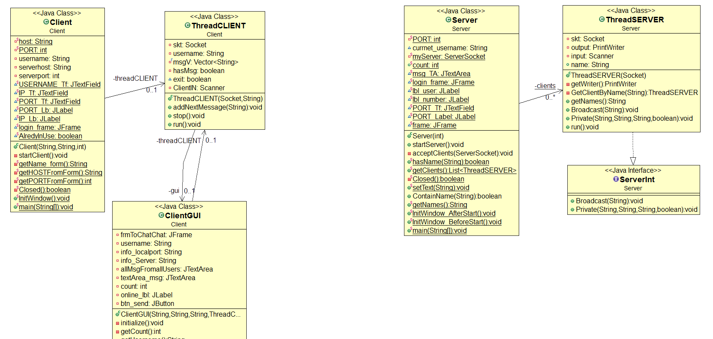
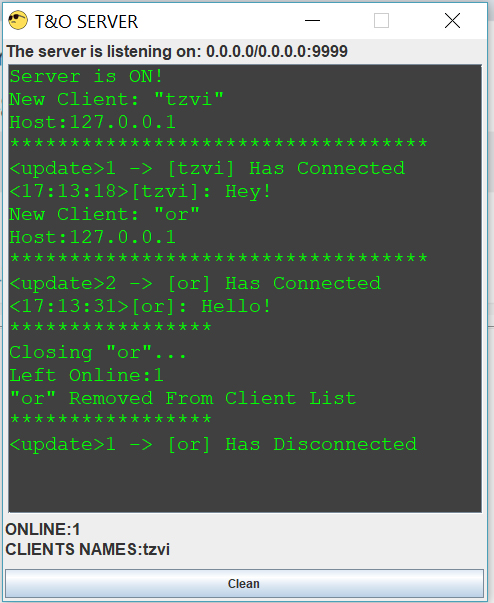

<h1>Chat Project</h1>  
 Created during a computer communication course during the second year at Ariel University 
  
 in the Department of Computer Science, 2018
<h3>Project site: <a href=https://github.com/ZviMints/Chat.git>https://github.com/ZviMints/Chat.git</a></h3>
<h1>About the program</h1>
This project implements a simple Server/ Client chat application using Java.
The program includes two packages:
 

The Client package allows to the client to connect into the server, and send message to 
 
the other people that also connected to the server, the client can send message, read messages,
 
send private messages, get info about who is online, get online client list and more.
  
The Server package allows all the client requests in parallel by using THREADS.
Moreover, The server has a  window which can get information about chat clients.
 
<h1>Class Diagram:</h1>

<h3>Client Package:</h3>

<h3>Server Package:</h3>

<h1>About the Server:</h1>
METHODS: 
 
 
 
The Server receives a port from the Server Owner that  greater than 1023 and then open Server with the inserted port.
Also in the server window there details about the server, for example who logged in or logged out of the server, and also who sent the message and administor options.
<h3>Photos:</h3>

<h1>Server Thread:</h1>
METHODS:
 

<h1>About the Client:</h1>
METHODS:
 
 
The Client insert the Server connection details, such as IP and PORT, if the Server is running on the
  
same computer as the client, the client can enter "localhost" as host.
 
after pressing "log in" , the client need to choose name, valid names are described below.
 
Then the client window opens with details about clients that alredy using the chat, also more option such as
 
cleaning the messages area and more.
 
The client can send a message to othe client, by CS model, the message moves to the server, and the 
 
server knows where to send that message
 
Each client can send a private message to another user.
In addition,each client get message if other client has joined or left the chat.
<h3>Connection</h3>
<list>
The user must enter a valid user name, a valid username is from the following form:
<li>A series of letters that are in an ASCII table with no spaces</li>
<li>A name that is not already on the Clients list</li>
</list>
if the Server is close, or the PORT is not valid, the user will get an error message.
 
<h3>Private Messages</h3>
<list>
<li>In order to send Private message to a user type @NAME|MSG</li>
If the name is not in the clients list or the message is not from the above form, the user will receive an error message
</list>
<h3>Photos:</h3>

<h1>Client Thread:</h1>
METHODS:
 

